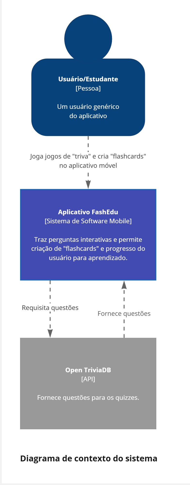
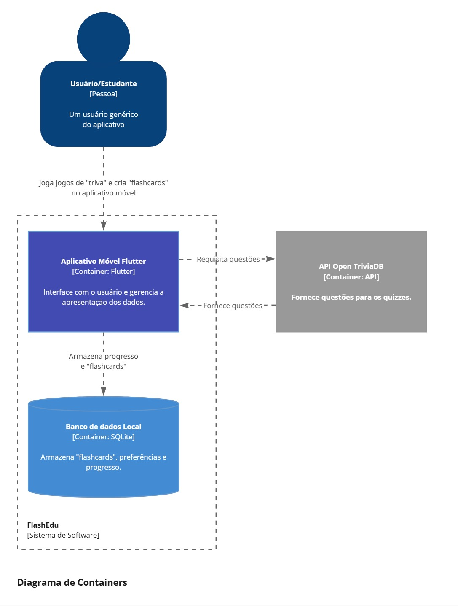
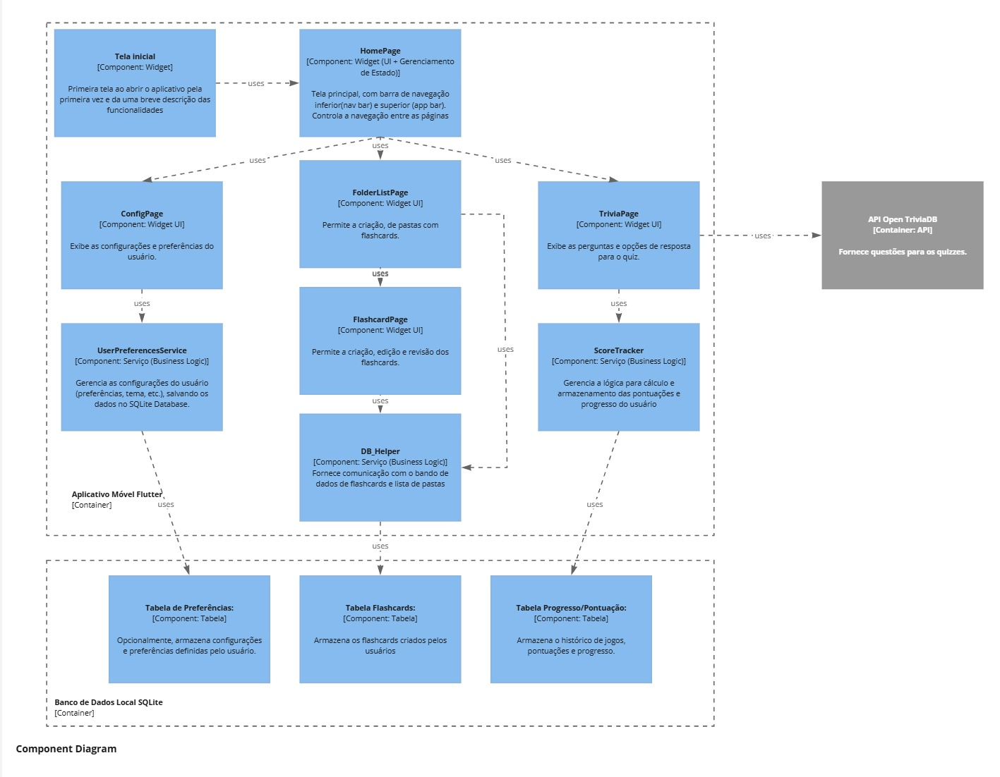

# Documentação da Arquitetura – FlashEdu

## (i) Escolhas de Tecnologias

O aplicativo **FlashEdu** foi desenvolvido utilizando as seguintes tecnologias:

- **Flutter**: Framework open source da Google para desenvolvimento de aplicativos móveis multiplataforma com foco em desempenho nativo.
- **Dart**: Linguagem utilizada pelo Flutter, de fácil aprendizado e altamente produtiva.
- **SQLite**: Banco de dados local leve e eficiente, ideal para armazenamento offline de informações do usuário, como flashcards, progresso e configurações.
- **Open TriviaDB**: API pública e gratuita utilizada para obtenção de questões de quiz atualizadas em tempo real, permitindo maior diversidade e reusabilidade.
- **GitHub Projects**: Utilizado para organização e acompanhamento do progresso do projeto, com backlog e planejamento das sprints.
- **Git**: Sistema de versionamento de código-fonte, com repositório público no GitHub para facilitar o controle e a colaboração.

---

## (ii) Projeto Arquitetural Elaborado

O modelo adotado segue os níveis propostos pelo **C4 Model**, organizando os elementos da aplicação de forma hierárquica e compreensível.

### Nível 1 – Diagrama de Contexto

Apresenta a visão geral da interação entre os usuários, o sistema e os serviços externos:

- **Usuário** interage com o aplicativo móvel **FlashEdu**.
- O sistema consome dados da **API Open TriviaDB** para gerar quizzes.
- Os dados de progresso são armazenados localmente em um **banco SQLite** no dispositivo do usuário.

### Nível 2 – Diagrama de Containers

Mostra a divisão da aplicação em containers:

- **App Flutter**: camada de interface e lógica de controle.
- **API Open TriviaDB**: fornece questões de quiz sob demanda.
- **Banco SQLite**: armazena localmente os dados persistentes do usuário.

### Nível 3 – Diagrama de Componentes

Exibe os principais componentes internos do aplicativo:

- **Widgets de UI**: `TelaInicial`, `HomePage`, `ConfigPage`, `TriviaPage`, `FlashcardPage`.
- **Serviços**: `UserPreferencesService` e `ScoreTracker`.
- **Repositórios e Banco**: `TabelaFlashcards`, `TabelaPreferências`, `TabelaProgresso`.
- **API Externa**: `TriviaService` responsável por acessar o Open TriviaDB.

---

## (iii) Justificativa do Modelo Escolhido

O **C4 Model** foi adotado por ser uma abordagem clara e incremental para modelar sistemas de software. Ele facilita a comunicação entre desenvolvedores, professores e avaliadores ao fornecer:

- Uma **visão de alto nível** (Nível 1) para mostrar o propósito geral do sistema.
- Uma **estrutura técnica** (Nível 2) que revela como os elementos principais se comunicam.
- Um **detalhamento dos componentes internos** (Nível 3), essencial para planejar e organizar a implementação de forma modular e escalável.

A escolha de Flutter e SQLite também contribui para um desenvolvimento ágil e eficiente, com suporte a testes locais, visual atraente e bom desempenho mesmo em dispositivos com hardware modesto.

---
