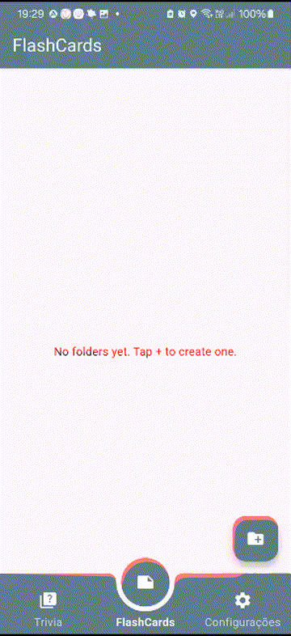
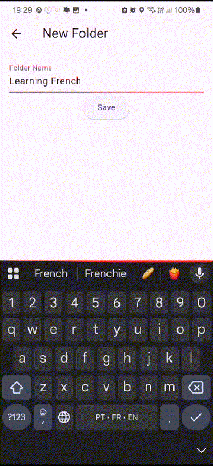
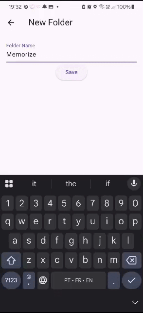
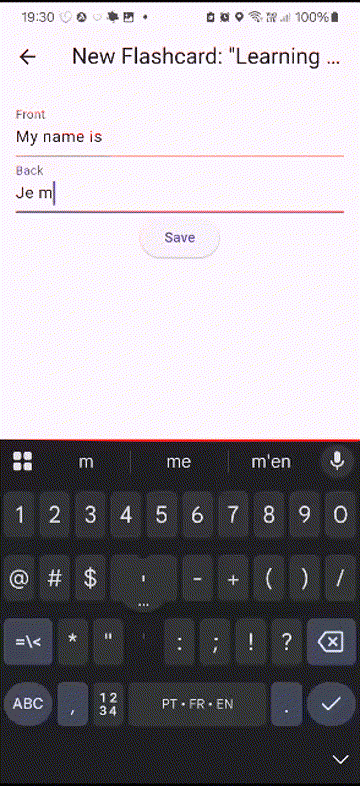
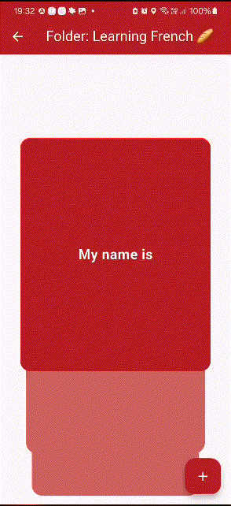

# FlashEdu
 FlashEdu – União entre FLASH (“Fun Learning And Study Hub”), e educação, enfatizando um espaço de estudo dinâmico.

 ### Pré-requisitos
* [Flutter](https://flutter.dev/docs/get-started/install) (versão Flutter 3.29.0 -> revision 35c388afb5 )
* Dart 3.7.0
* DevTools 2.42.2
* Um emulador Android/iOS ou um dispositivo físico
 
 ## Objetivo Geral:
 Desenvolver um aplicativo móvel de perguntas e respostas (trivia) que promova a educação de qualidade, alinhado ao ODS 4: Educação de Qualidade. O app utilizará a Open Trivia Database API para fornecer questões personalizadas e interativas, estimulando o aprendizado de forma divertida e dinâmica.
 
 
 ## Definição do Problema
 Apesar do crescente acesso à tecnologia, muitos estudantes ainda enfrentam dificuldades em manter o interesse e a retenção do conteúdo escolar. A falta de interatividade nos métodos tradicionais de ensino pode contribuir para a desmotivação.
 
 
 ### Problema a ser resolvido:
 Criar uma solução que torne o processo de aprendizagem mais interativo e engajador, permitindo que os usuários aprendam por meio de jogos de trivia e flashcards, reforçando o conhecimento de forma lúdica.
 
 ### Solução Proposta:
 Um aplicativo móvel com funcionalidades de trivia (perguntas e respostas) e um módulo para criação e revisão de flashcards.
 
 **Front-end:** Interface intuitiva e interativa para o usuário.
 
 **Back-end:** Integração com a Open Trivia Database API para obter as questões, gerenciamento de pontuações, progresso e flashcards (armazenados localmente ou por meio de um serviço em nuvem gratuito, como o Firebase).
 
 # Requisitos da Aplicação
 ### Requisitos Funcionais
 
 **Gerenciamento de Perfil:**
 
 > Edição de perfil e preferencias do usuário.
 
 **Módulo Trivia:**
 > Consumir a Open Trivia Database API (https://opentdb.com/api_config.php) para exibir perguntas em múltipla escolha.
 
 > Exibir feedback imediato sobre respostas corretas ou incorretas.
 
 > Registrar a pontuação e atualizar um progresso.
 
 **Módulo Flashcards:**
 
 > Permitir que os usuários criem, editem e revisem flashcards para reforçar o aprendizado.
 
 **Interface Interativa:**
 
 > Interface responsiva e de fácil navegação entre as seções de trivia e flashcards.
 
 **Configurações e Preferências:**
 
 > Permitir ao usuário escolher categorias e níveis de dificuldade para os quizzes.
 
 ### Requisitos Não Funcionais
 
 **Usabilidade:**
 
 > A interface deve ser intuitiva, acessível e adaptada para dispositivos móveis.
 
 **Confiabilidade:**
 
 > Garantir disponibilidade nos períodos de uso ativo.


# Documentação da Arquitetura – FlashEdu

## (i) Escolhas de Tecnologias

O aplicativo **FlashEdu** foi desenvolvido utilizando as seguintes tecnologias:

- **Flutter**: Framework open source da Google para desenvolvimento de aplicativos móveis multiplataforma com foco em desempenho nativo.
- **Dart**: Linguagem utilizada pelo Flutter, de fácil aprendizado e altamente produtiva.
- **SQLite**: Banco de dados local leve e eficiente, ideal para armazenamento offline de informações do usuário, como flashcards, progresso e configurações.
- **Open TriviaDB**: API pública e gratuita utilizada para obtenção de questões de quiz atualizadas em tempo real, permitindo maior diversidade e reusabilidade.
- **GitHub Projects**: Utilizado para organização e acompanhamento do progresso do projeto, com backlog e planejamento das sprints.
- **Git**: Sistema de versionamento de código-fonte, com repositório público no GitHub para facilitar o controle e a colaboração.

---

## (ii) Projeto Arquitetural Elaborado

O modelo adotado segue os níveis propostos pelo **C4 Model**, organizando os elementos da aplicação de forma hierárquica e compreensível.

### Nível 1 – Diagrama de Contexto

Apresenta a visão geral da interação entre os usuários, o sistema e os serviços externos:

- **Usuário** interage com o aplicativo móvel **FlashEdu**.
- O sistema consome dados da **API Open TriviaDB** para gerar quizzes.
- Os dados de progresso são armazenados localmente em um **banco SQLite** no dispositivo do usuário.

<p>
  
</p>

### Nível 2 – Diagrama de Containers

Mostra a divisão da aplicação em containers:

- **App Flutter**: camada de interface e lógica de controle.
- **API Open TriviaDB**: fornece questões de quiz sob demanda.
- **Banco SQLite**: armazena localmente os dados persistentes do usuário.


### Nível 3 – Diagrama de Componentes

Exibe os principais componentes internos do aplicativo:

- **Widgets de UI**: `TelaInicial`, `HomePage`, `ConfigPage`, `TriviaPage`, `FlashcardPage`.
- **Serviços**: `UserPreferencesService` e `ScoreTracker`.
- **Repositórios e Banco**: `TabelaFlashcards`, `TabelaPreferências`, `TabelaProgresso`.
- **API Externa**: `TriviaService` responsável por acessar o Open TriviaDB.


---

## (iii) Justificativa do Modelo Escolhido

O **C4 Model** foi adotado por ser uma abordagem clara e incremental para modelar sistemas de software. Ele facilita a comunicação entre desenvolvedores, professores e avaliadores ao fornecer:

- Uma **visão de alto nível** (Nível 1) para mostrar o propósito geral do sistema.
- Uma **estrutura técnica** (Nível 2) que revela como os elementos principais se comunicam.
- Um **detalhamento dos componentes internos** (Nível 3), essencial para planejar e organizar a implementação de forma modular e escalável.

A escolha de Flutter e SQLite também contribui para um desenvolvimento ágil e eficiente, com suporte a testes locais, visual atraente e bom desempenho mesmo em dispositivos com hardware modesto.

---

 ## Capturas de tela 

| Tema | Resposta correta | Respostas erradas |
| ---------------------- | :------------- | :---------------- |
 |  | |


| Pasta Vazia | Nova Pasta | Varias Pastas |
| ---------------------- | :------------- | :---------------- |
 |  | |


| Novo Flashcard | Varios flashcards | Tema diferente |
| ---------------------- | :------------- | :---------------- |
 |  | |

 ## Estrutura do Repositório
 
 ```bash

│   README.md
│
├───Arquitetura
│       Components.jpg
│       Containers.jpg
│       Context.jpg
│       README.md
│
├───FlashEdu (Componentes do aplicativo + testes de software)
│   └───flashedu
│       │   pubspec.lock
│       │   pubspec.yaml
│       │
│       ├── assets (imagens)
│       │   │   logo.png
│       │
│       ├───lib
│       │   │   AboutTheApp.dart
│       │   │   home_page.dart
│       │   │   main.dart
│       │   │
│       │   ├───Flashcards
│       │   │       db_helper.dart
│       │   │       flashcard_page.dart
│       │   │       folder_list_page.dart
│       │   │
│       │   ├───models
│       │   │       flashcard.dart
│       │   │       folder.dart
│       │   │
│       │   ├───Settings
│       │   │       config_page.dart
│       │   │       userPreferencesService.dart
│       │   │
│       │   └───Trivia
│       │           scoreTracker.dart
│       │           trivia_page.dart
│       │
│       └───test
│               AboutTheApp_test.dart
│               Flashcards_test.dart
│
├───Testes_de_software
│       README.md
│
└───Videos  (Contém os vídeos de detalhes do projeto.)
    │   Desenvolvimento_1.mp4
    │   README.md
    │
    └───gif
            emptyfolder.gif
            flashcard_roxo.gif
            flashcard_vermelho.gif
            multiple_flashcards.gif
            multiple_folders.gif
            newfolder.gif
            new_flashcards.gif
            theme.gif
            trivia_correct.gif
            trivia_wrong.gif
```
