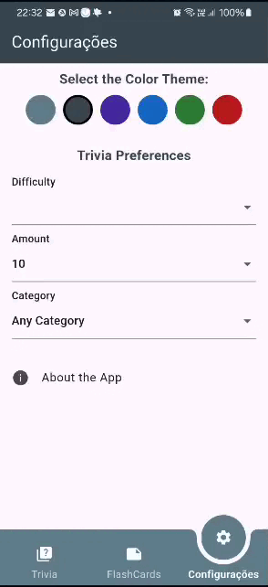
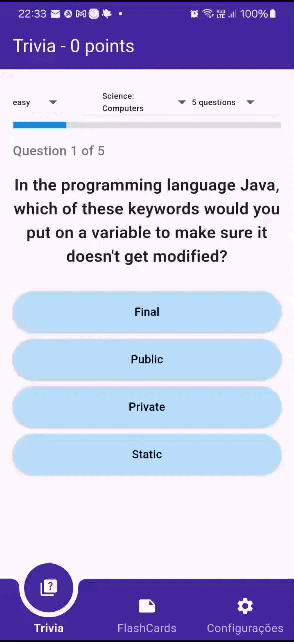
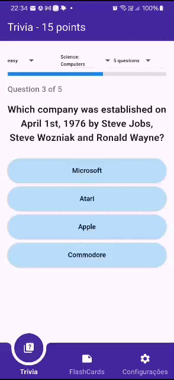

TP3 - Sprint de Desenvolvimento
Criação de um primeiro entregável (software que funciona).

[▶️ Ver vídeo de demonstração](Desenvolvimento_1.mp4)
[▶️ Ver o vídeo no youtube](https://www.youtube.com/watch?v=519pjPra-l8)

## SnapShots

### |-------- Tema --------|------- Resposta correta --------|------ Respostas erradas ------|

