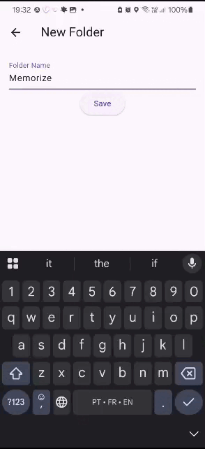

TP3 - Sprint de Desenvolvimento
Criação de um primeiro entregável (software que funciona).

[▶️ Ver vídeo de demonstração](Desenvolvimento_1.mp4)
[▶️ Ver o vídeo no youtube](https://www.youtube.com/watch?v=519pjPra-l8)

## SnapShots

| Tema | Resposta correta | Respostas erradas |
| ---------------------- | :------------- | :---------------- |
 |  | |

TP4 - Sprint de Desenvolvimento
Novas Funcionalidades

| Pasta Vazia | Nova Pasta | Varias Pastas |
| ---------------------- | :------------- | :---------------- |
 |  | |